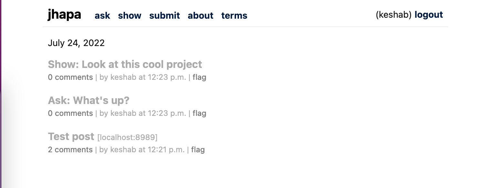

## Intro

A link aggregation system written on Django. Heavily inspired by the yellow site.

## Install

Install pip dependencies

```shell
pip install -r requirements/dev.txt
```

Then run

```shell
cd server
python manage.py migrate
python manage.py init_jhapa
```

## Screenshot


